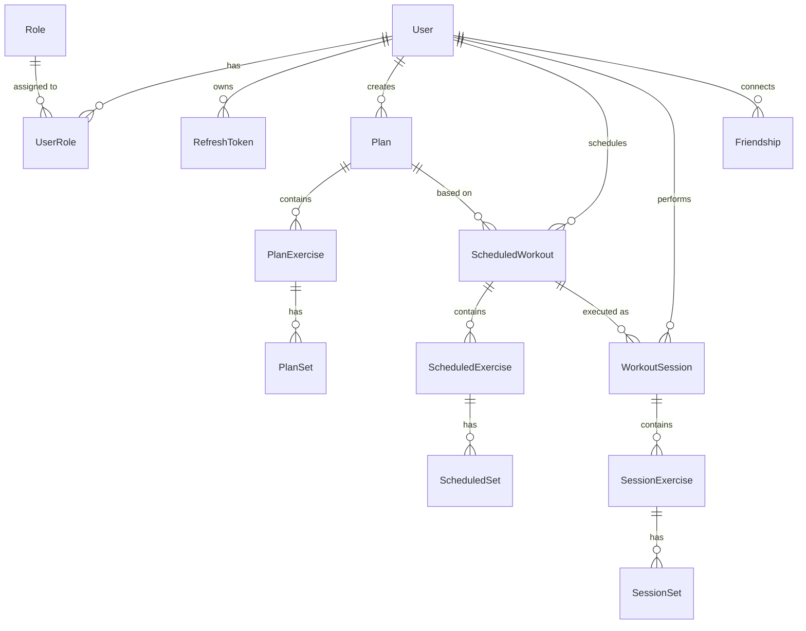
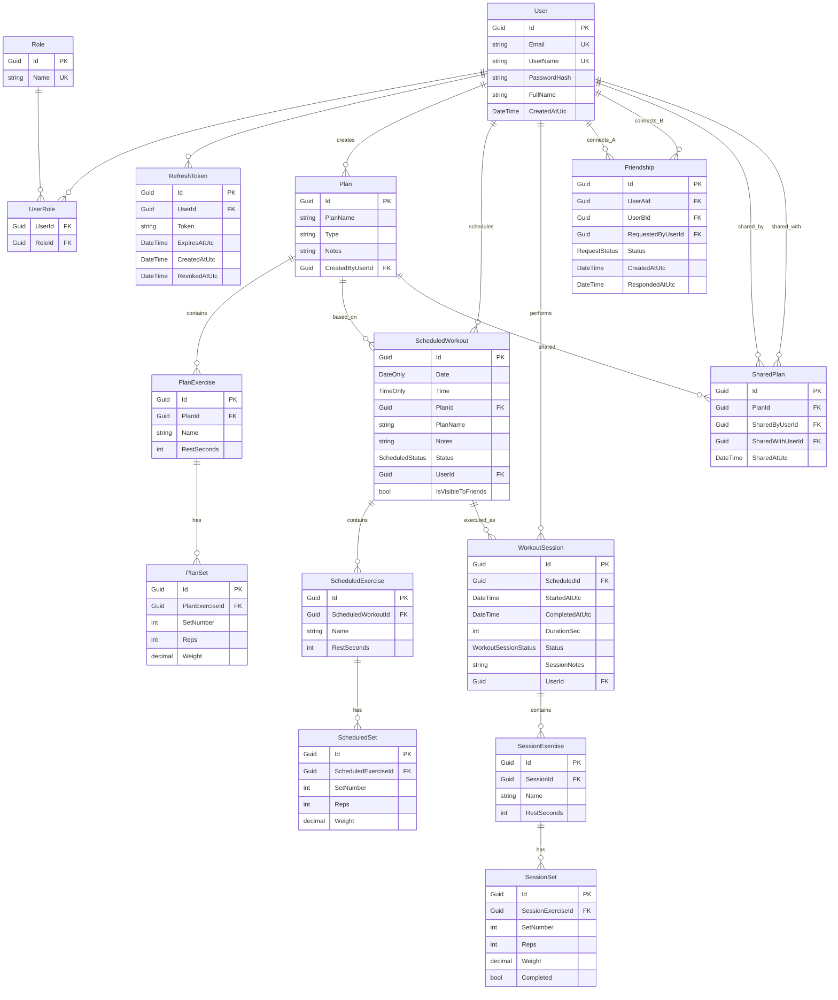
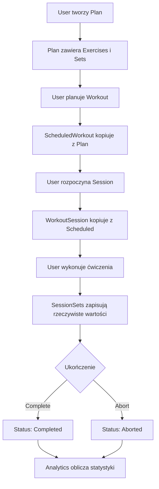

# FitMateBackend - Dokumentacja Warstwy Domain

## Spis Treści
1. [Przegląd](#przegląd)
2. [Architektura](#architektura)
3. [Encje](#encje)
4. [Enumeracje](#enumeracje)
5. [Relacje Między Encjami](#relacje-między-encjami)
6. [Diagramy](#diagramy)
7. [Reguły Biznesowe](#reguły-biznesowe)

---

## Przegląd

Warstwa Domain zawiera podstawową logikę biznesową aplikacji FitMateBackend. Jest to centralna warstwa w architekturze Clean Architecture, całkowicie niezależna od frameworków i zewnętrznych bibliotek.

### Charakterystyka
- ✅ **Niezależność** - Brak zależności od innych warstw
- ✅ **Czystość** - Tylko POCO (Plain Old CLR Objects)
- ✅ **Stabilność** - Najmniej zmieniająca się warstwa
- ✅ **Przejrzystość** - Representation prawdziwego modelu domenowego

### Statystyki
- **Encje**: 16
- **Enumeracje**: 3
- **Relacje**: 25+ (1:N, N:M)

---

## Architektura

```
Domain/
├── Entities/               # 15 encji domenowych
│   ├── User.cs            # Użytkownik systemu
│   ├── Role.cs            # Rola użytkownika
│   ├── UserRole.cs        # Powiązanie User-Role (N:M)
│   ├── RefreshToken.cs    # Token odświeżania JWT
│   ├── Plan.cs            # Szablon planu treningowego
│   ├── PlanExercise.cs    # Ćwiczenie w planie
│   ├── PlanSet.cs         # Seria w ćwiczeniu planu
│   ├── ScheduledWorkout.cs # Zaplanowany trening
│   ├── ScheduledExercise.cs # Ćwiczenie w zaplanowanym treningu
│   ├── ScheduledSet.cs    # Seria w zaplanowanym treningu
│   ├── WorkoutSession.cs  # Sesja treningowa (wykonanie)
│   ├── SessionExercise.cs # Ćwiczenie w sesji
│   ├── SessionSet.cs      # Seria w sesji (rzeczywiste wykonanie)
│   ├── Friendship.cs      # Relacja znajomości
│   ├── SharedPlan.cs      # Udostępniony plan
│   └── BodyMeasurement.cs # Pomiar ciała użytkownika
│
└── Enums/                 # 3 enumeracje
    ├── RequestStatus.cs   # Status zapytania (Pending/Accepted/Rejected)
    ├── ScheduledStatus.cs # Status zaplanowanego treningu
    └── WorkoutSessionStatus.cs # Status sesji treningowej
```

---

## Encje

### 1. User (Użytkownik)

**Opis**: Reprezentuje użytkownika systemu z pełnymi danymi uwierzytelniania i profilu.

**Właściwości**:
```csharp
public class User
{
    public Guid Id { get; set; }                    // PK
    public string Email { get; set; }               // Unikalne, wymagane
    public string PasswordHash { get; set; }        // Zahashowane hasło
    public string? FullName { get; set; }           // Pełne imię i nazwisko
    public string UserName { get; set; }            // Unikalna nazwa użytkownika
    public DateTime CreatedAtUtc { get; set; }      // Data utworzenia
    
    // Nawigacja
    public ICollection<UserRole> UserRoles { get; set; }           // Role użytkownika
    public ICollection<RefreshToken> RefreshTokens { get; set; }   // Tokeny odświeżania
    public ICollection<BodyMeasurement> BodyMeasurements { get; set; } // Pomiary ciała
}
```

**Reguły Biznesowe**:
- Email musi być unikalny w systemie
- UserName musi być unikalny i spełniać pattern `^[A-Za-z0-9._-]+$` (bez spacji)
- PasswordHash przechowuje hasło w formie zahashowanej (BCrypt)
- CreatedAtUtc jest automatycznie ustawiany na czas UTC

**Relacje**:
- `1:N` → UserRole (jeden użytkownik może mieć wiele ról)
- `1:N` → RefreshToken (jeden użytkownik może mieć wiele tokenów)
- `1:N` → Plan (użytkownik tworzy plany)
- `1:N` → ScheduledWorkout (użytkownik planuje treningi)
- `1:N` → WorkoutSession (użytkownik wykonuje sesje)
- `1:N` → BodyMeasurement (użytkownik rejestruje pomiary)
- `N:M` → Friendship (relacje znajomości)

---

### 2. Role (Rola)

**Opis**: Reprezentuje rolę użytkownika w systemie (np. "User", "Admin").

**Właściwości**:
```csharp
public class Role
{
    public Guid Id { get; set; }                    // PK
    public string Name { get; set; }                // "User", "Admin"
    
    // Nawigacja
    public ICollection<UserRole> UserRoles { get; set; }
}
```

**Predefiniowane Role**:
- `User` - Standardowy użytkownik (domyślna)
- `Admin` - Administrator systemu

**Reguły Biznesowe**:
- Każdy użytkownik musi mieć minimum rolę "User"
- Role są seedowane przy inicjalizacji bazy danych

---

### 3. UserRole (Powiązanie Użytkownik-Rola)

**Opis**: Tabela łącząca User i Role (relacja N:M).

**Właściwości**:
```csharp
public class UserRole
{
    public Guid UserId { get; set; }                // FK → User
    public Guid RoleId { get; set; }                // FK → Role
    
    // Nawigacja
    public User User { get; set; }
    public Role Role { get; set; }
}
```

**Klucz Główny**: Kompozytowy (UserId, RoleId)

---

### 4. RefreshToken (Token Odświeżania)

**Opis**: Token JWT wykorzystywany do odświeżania access tokenów.

**Właściwości**:
```csharp
public class RefreshToken
{
    public Guid Id { get; set; }                    // PK
    public Guid UserId { get; set; }                // FK → User
    public string Token { get; set; }               // Token string
    public DateTime ExpiresAtUtc { get; set; }      // Data wygaśnięcia
    public DateTime CreatedAtUtc { get; set; }      // Data utworzenia
    public DateTime? RevokedAtUtc { get; set; }     // Data unieważnienia
    
    // Computed property
    public bool IsActive => RevokedAtUtc == null && DateTime.UtcNow < ExpiresAtUtc;
    
    // Nawigacja
    public User User { get; set; }
}
```

**Reguły Biznesowe**:
- Token jest aktywny tylko jeśli nie został unieważniony i nie wygasł
- Po wylogowaniu token jest unieważniany (RevokedAtUtc)
- Domyślny czas życia: 7 dni

---

### 5. Plan (Szablon Planu Treningowego)

**Opis**: Szablon planu treningowego zawierający ćwiczenia i serie.

**Właściwości**:
```csharp
public class Plan
{
    public Guid Id { get; set; }                    // PK
    public string PlanName { get; set; }            // Nazwa planu
    public string Type { get; set; }                // Typ (PPL, FullBody, Upper/Lower, itp.)
    public string? Notes { get; set; }              // Notatki
    public Guid CreatedByUserId { get; set; }       // FK → User
    
    // Nawigacja
    public User CreatedByUser { get; set; }
    public ICollection<PlanExercise> Exercises { get; set; }
}
```

**Typy Planów** (przykłady):
- `PPL` - Push/Pull/Legs
- `FullBody` - Full Body
- `Upper/Lower` - Upper/Lower Split
- `Bro Split` - tradycyjny podział na partie

**Reguły Biznesowe**:
- Plan może być tworzony tylko przez zalogowanego użytkownika
- Plan musi zawierać przynajmniej jedno ćwiczenie
- Użytkownik może edytować/usuwać tylko własne plany

---

### 6. PlanExercise (Ćwiczenie w Planie)

**Opis**: Ćwiczenie wchodzące w skład planu treningowego.

**Właściwości**:
```csharp
public class PlanExercise
{
    public Guid Id { get; set; }                    // PK
    public Guid PlanId { get; set; }                // FK → Plan
    public string Name { get; set; }                // Nazwa ćwiczenia
    public int RestSeconds { get; set; } = 90;      // Przerwa (domyślnie 90s)
    
    // Nawigacja
    public Plan Plan { get; set; }
    public ICollection<PlanSet> Sets { get; set; }
}
```

**Reguły Biznesowe**:
- RestSeconds domyślnie 90 sekund
- Każde ćwiczenie musi mieć przynajmniej jedną serię

---

### 7. PlanSet (Seria w Planie)

**Opis**: Planowana seria w ćwiczeniu (szablon).

**Właściwości**:
```csharp
public class PlanSet
{
    public Guid Id { get; set; }                    // PK
    public Guid PlanExerciseId { get; set; }        // FK → PlanExercise
    public int SetNumber { get; set; }              // Numer serii (1, 2, 3...)
    public int Reps { get; set; }                   // Liczba powtórzeń
    public decimal Weight { get; set; }             // Ciężar (kg)
    
    // Nawigacja
    public PlanExercise PlanExercise { get; set; }
}
```

**Reguły Biznesowe**:
- SetNumber są ponumerowane od 1 wzwyż
- Reps > 0
- Weight >= 0

---

### 8. ScheduledWorkout (Zaplanowany Trening)

**Opis**: Konkretny trening zaplanowany na określony dzień/czas na podstawie planu.

**Właściwości**:
```csharp
public class ScheduledWorkout
{
    public Guid Id { get; set; }                    // PK
    public DateOnly Date { get; set; }              // Data treningu
    public TimeOnly? Time { get; set; }             // Godzina treningu (opcjonalna)
    public Guid PlanId { get; set; }                // FK → Plan
    public string PlanName { get; set; }            // Zdenormalizowana nazwa planu
    public string? Notes { get; set; }              // Notatki
    public ScheduledStatus Status { get; set; }     // Planned/Completed
    public Guid UserId { get; set; }                // FK → User
    public bool IsVisibleToFriends { get; set; }    // Widoczność dla znajomych
    
    // Nawigacja
    public Plan Plan { get; set; }
    public User User { get; set; }
    public ICollection<ScheduledExercise> Exercises { get; set; }
}
```

**Reguły Biznesowe**:
- PlanName jest kopiowany z Plan przy tworzeniu (denormalizacja)
- Status domyślnie `Planned`
- IsVisibleToFriends domyślnie `false`
- Tylko właściciel może edytować/usuwać

---

### 9. ScheduledExercise (Ćwiczenie w Zaplanowanym Treningu)

**Opis**: Konkretne ćwiczenie w zaplanowanym treningu (kopia z planu).

**Właściwości**:
```csharp
public class ScheduledExercise
{
    public Guid Id { get; set; }
    public Guid ScheduledWorkoutId { get; set; }
    public string Name { get; set; }
    public int RestSeconds { get; set; }
    
    // Nawigacja
    public ScheduledWorkout ScheduledWorkout { get; set; }
    public ICollection<ScheduledSet> Sets { get; set; }
}
```

**Reguły Biznesowe**:
- Kopiowane z PlanExercise przy tworzeniu ScheduledWorkout
- Może być modyfikowane niezależnie od planu źródłowego

---

### 10. ScheduledSet (Seria w Zaplanowanym Treningu)

**Opis**: Planowana seria w zaplanowanym ćwiczeniu.

**Właściwości**:
```csharp
public class ScheduledSet
{
    public Guid Id { get; set; }
    public Guid ScheduledExerciseId { get; set; }
    public int SetNumber { get; set; }
    public int Reps { get; set; }
    public decimal Weight { get; set; }
    
    // Nawigacja
    public ScheduledExercise ScheduledExercise { get; set; }
}
```

---

### 11. WorkoutSession (Sesja Treningowa)

**Opis**: Rzeczywiste wykonanie treningu przez użytkownika.

**Właściwości**:
```csharp
public class WorkoutSession
{
    public Guid Id { get; set; }                        // PK
    public Guid ScheduledId { get; set; }               // FK → ScheduledWorkout
    public DateTime StartedAtUtc { get; set; }          // Czas rozpoczęcia
    public DateTime? CompletedAtUtc { get; set; }       // Czas zakończenia
    public int? DurationSec { get; set; }               // Czas trwania (sekundy)
    public WorkoutSessionStatus Status { get; set; }    // InProgress/Completed/Aborted
    public string? SessionNotes { get; set; }           // Notatki z sesji
    public Guid UserId { get; set; }                    // FK → User
    
    // Nawigacja
    public ScheduledWorkout Scheduled { get; set; }
    public User User { get; set; }
    public ICollection<SessionExercise> Exercises { get; set; }
}
```

**Reguły Biznesowe**:
- Status domyślnie `InProgress`
- CompletedAtUtc i DurationSec ustawiane przy zakończeniu
- DurationSec = (CompletedAtUtc - StartedAtUtc).TotalSeconds
- Może być przerwana (Aborted) bez ustawienia CompletedAtUtc

---

### 12. SessionExercise (Ćwiczenie w Sesji)

**Opis**: Ćwiczenie wykonywane podczas sesji treningowej.

**Właściwości**:
```csharp
public class SessionExercise
{
    public Guid Id { get; set; }
    public Guid SessionId { get; set; }
    public string Name { get; set; }
    public int RestSeconds { get; set; }
    
    // Nawigacja
    public WorkoutSession Session { get; set; }
    public ICollection<SessionSet> Sets { get; set; }
}
```

**Reguły Biznesowe**:
- Inicjalnie kopiowane z ScheduledExercise
- Użytkownik może dodać dodatkowe ćwiczenia podczas sesji

---

### 13. SessionSet (Seria w Sesji)

**Opis**: Rzeczywiście wykonana seria w sesji treningowej.

**Właściwości**:
```csharp
public class SessionSet
{
    public Guid Id { get; set; }
    public Guid SessionExerciseId { get; set; }
    public int SetNumber { get; set; }
    public int Reps { get; set; }                   // Wykonane powtórzenia
    public decimal Weight { get; set; }             // Użyty ciężar
    public bool Completed { get; set; }             // Czy ukończona
    
    // Nawigacja
    public SessionExercise SessionExercise { get; set; }
}
```

**Reguły Biznesowe**:
- Rzeczywiste wartości Reps i Weight mogą różnić się od planu
- Completed służy do śledzenia postępu podczas sesji

---

### 14. Friendship (Znajomość)

**Opis**: Relacja znajomości między dwoma użytkownikami.

**Właściwości**:
```csharp
public class Friendship
{
    public Guid Id { get; set; }                    // PK
    public Guid UserAId { get; set; }               // FK → User
    public Guid UserBId { get; set; }               // FK → User
    public Guid RequestedByUserId { get; set; }     // Kto wysłał zaproszenie
    public RequestStatus Status { get; set; }       // Pending/Accepted/Rejected
    public DateTime CreatedAtUtc { get; set; }      // Czas utworzenia
    public DateTime? RespondedAtUtc { get; set; }   // Czas odpowiedzi
    
    // Nawigacja
    public User UserA { get; set; }
    public User UserB { get; set; }
    public User RequestedByUser { get; set; }
}
```

**Reguły Biznesowe**:
- UserAId < UserBId (klucz naturalny - zawsze mniejszy ID jako A)
- RequestedByUserId wskazuje kto wysłał zaproszenie
- Status Pending → tylko jeden użytkownik może odpowiedzieć (nie nadawca)
- RespondedAtUtc ustawiane przy zmianie statusu na Accepted/Rejected
- Duplikaty zaproszeń są blokowane na poziomie usługi

---

### 15. SharedPlan (Udostępniony Plan)

**Opis**: Plan udostępniony jednemu użytkownikowi przez drugiego.

**Właściwości**:
```csharp
public class SharedPlan
{
    public Guid Id { get; set; }
    public Guid PlanId { get; set; }
    public Guid SharedByUserId { get; set; }
    public Guid SharedWithUserId { get; set; }
    public DateTime SharedAtUtc { get; set; }
    
    // Nawigacja
    public Plan Plan { get; set; }
    public User SharedByUser { get; set; }
    public User SharedWithUser { get; set; }
}
```

**Reguły Biznesowe**:
- SharedByUserId musi być właścicielem planu
- Użytkownik może udostępnić plan wielu osobom
- Udostępniony plan jest tylko do odczytu (odbiorca nie może edytować)

---

### 16. BodyMeasurement (Pomiar Ciała)

**Opis**: Historyczny zapis pomiarów ciała użytkownika (waga, wzrost, obwody).

**Właściwości**:
```csharp
public class BodyMeasurement
{
    public Guid Id { get; set; }                    // PK
    public Guid UserId { get; set; }                // FK → User
    public DateTime Date { get; set; }              // Data pomiaru
    public decimal WeightKg { get; set; }           // Waga (kg)
    public int HeightCm { get; set; }               // Wzrost (cm)
    public decimal BMI { get; set; }                // BMI (obliczane)
    public decimal? BodyFatPercentage { get; set; } // % tkanki tłuszczowej (opcjonalne)
    public int? ChestCm { get; set; }               // Obwód klatki (opcjonalne)
    public int? WaistCm { get; set; }               // Obwód talii (opcjonalne)
    public int? HipsCm { get; set; }                // Obwód bioder (opcjonalne)
    public int? BicepsCm { get; set; }              // Obwód bicepsa (opcjonalne)
    public int? ThighsCm { get; set; }              // Obwód uda (opcjonalne)
    public string? Notes { get; set; }              // Notatki
    
    // Nawigacja
    public User User { get; set; }
}
```

**Reguły Biznesowe**:
- BMI jest obliczane i zapisywane (denormalizacja) dla wydajności
- Waga i Wzrost muszą być dodatnie
- Użytkownik może dodawać wiele pomiarów dziennie (choć zalecane rzadziej)
- Pomiary są prywatne dla użytkownika

---

## Enumeracje

### 1. RequestStatus

**Opis**: Status zapytania (zaproszenie do znajomych, udostępnienie planu).

```csharp
public enum RequestStatus
{
    Pending = 0,    // Oczekujące
    Accepted = 1,   // Zaakceptowane
    Rejected = 2    // Odrzucone
}
```

**Użycie**: 
- `Friendship.Status`
- Potencjalnie w SharedPlan (jeśli dodana funkcjonalność zatwierdzania)

---

### 2. ScheduledStatus

**Opis**: Status zaplanowanego treningu.

```csharp
public enum ScheduledStatus
{
    Planned = 0,    // Zaplanowane (przyszłe/niewykonane)
    Completed = 1   // Ukończone
}
```

**Użycie**: 
- `ScheduledWorkout.Status`

**Reguły**:
- Status zmienia się na Completed po rozpoczęciu sesji
- Wykorzystywane w analityce (adherence rate)

---

### 3. WorkoutSessionStatus

**Opis**: Status sesji treningowej.

```csharp
public enum WorkoutSessionStatus
{
    InProgress = 0, // W trakcie
    Completed = 1,  // Ukończona
    Aborted = 2     // Przerwana
}
```

**Użycie**: 
- `WorkoutSession.Status`

**Przepływ**:
- Start → `InProgress`
- Complete → `Completed`
- Abort → `Aborted`

---

## Relacje Między Encjami

### Diagram Relacji (Główne)



### Kluczowe Relacje

#### 1. User → Plans → Scheduled → Sessions
**Przepływ treningowy**:
```
User tworzy Plan 
  → Plan używany do Schedule Workout
    → ScheduledWorkout wykonywany jako Session
      → Session zawiera rzeczywiste dane
```

#### 2. Hierarchia Ćwiczeń
**Trzy poziomy granularności**:
```
Plan Template:
└─ PlanExercise (szablon)
   └─ PlanSet (docelowe wartości)

Scheduled Instance:
└─ ScheduledExercise (kopia do modyfikacji)
   └─ ScheduledSet (planowane wartości)

Actual Execution:
└─ SessionExercise (wykonywane)
   └─ SessionSet (rzeczywiste wartości)
```

#### 3. Friendship (Bidirectional)
**Optymalizacja relacji N:M**:
```
User A ←→ User B
- Tylko jeden rekord Friendship
- UserAId zawsze < UserBId
- RequestedByUserId wskazuje inicjatora
```

---

## Diagramy

### 1. Model Danych Kompletny



### 2. Cykl Życia Treningu



---

## Reguły Biznesowe

### Autentykacja i Autoryzacja
1. **Hasła** są zawsze hashowane (BCrypt) - nigdy plain text
2. **RefreshToken** wygasa po 7 dniach
3. **AccessToken** wygasa po 60 minutach
4. **Role** są seedowane przy inicjalizacji (User, Admin)
5. Każdy nowy użytkownik automatycznie otrzymuje rolę "User"

### Plany Treningowe
1. Użytkownik może **edytować/usuwać tylko własne plany**
2. Plan musi zawierać **minimum jedno ćwiczenie**
3. Każde ćwiczenie musi mieć **minimum jedną serię**
4. **Type** planu jest tekstem (nie enum) - elastyczność
5. **Duplikacja planu** tworzy głęboką kopię z nowym GUID

### Zaplanowane Treningi
1. **PlanName** jest denormalizowany (kopia) - zachowanie historii
2. **ScheduledWorkout kopiuje ćwiczenia z Plan** przy utworzeniu
3. Modyfikacje scheduled nie wpływają na Plan
4. **IsVisibleToFriends** kontroluje widoczność dla znajomych
5. Status zmienia się na Completed po zakończeniu sesji

### Sesje Treningowe
1. **Jedna ScheduledWorkout → wiele WorkoutSession** (można powtórzyć)
2. **Status InProgress → tylko jedna aktywna sesja** na użytkownika
3. **DurationSec** obliczany automatycznie przy Complete
4. **SessionSets** mogą mieć Completed=false (seria pominięta)
5. Abort nie ustawia CompletedAtUtc (sesja przerwana)

### Znajomości
1. **Friendship jest bidirectional** (jeden rekord dla obu kierunków)
2. **UserAId < UserBId** zawsze (optymalizacja)
3. **Pending request** może odpowiedzieć tylko odbiorca
4. **Accepted friendship** pozwala widzieć treningi (IsVisibleToFriends)
5. Duplikaty zaproszeń są blokowane

### Analityka
1. **Volume** = sum(Reps × Weight) dla wszystkich SessionSets
2. **E1RM** = Weight × (1 + Reps/30) - wzór Brzycki
3. **Adherence** = (Completed Scheduled / Total Scheduled) × 100%
4. Statystyki obliczane **tylko z Completed Sessions**

---

## Konwencje Projektowe

### Nazewnictwo
- Encje: PascalCase (User, Plan)
- Właściwości: PascalCase (PlanName, CreatedAtUtc)
- Klucze obce: `{Entity}Id` (UserId, PlanId)
- Nawigacje: PascalCase nazwa encji (User, Plan)
- Kolekcje: Liczba mnoga (Exercises, Sets)

### Typy Danych
- **Identyfikatory**: Guid (UUID)
- **Teksty**: string (nie null albo nullable zgodnie z logiką)
- **Daty/Czasy**: DateTime (zawsze UTC), DateOnly, TimeOnly
- **Liczby całkowite**: int
- **Liczby dziesiętne**: decimal (precyzja dla wagi)
- **Flagi**: bool

### Navigation Properties
- **Required**: `public Entity Property { get; set; } = null!;`
- **Optional**: `public Entity? Property { get; set; }`
- **Collections**: `public ICollection<Entity> Properties { get; set; } = new List<Entity>();`

---

## Podsumowanie

Warstwa Domain FitMateBackend jest:
- ✅ **Kompletna** - 15 encji pokrywających cały model biznesowy
- ✅ **Niezależna** - Zero zależności zewnętrznych
- ✅ **Przejrzysta** - Klarowne relacje i reguły
- ✅ **Rozszerzalna** - Łatwo dodać nowe funkcjonalności
- ✅ **Testowalna** - Pure POCO bez frameworkowej logiki

Model wspiera pełny cykl życia treningu: Plan → Schedule → Session → Analytics.
